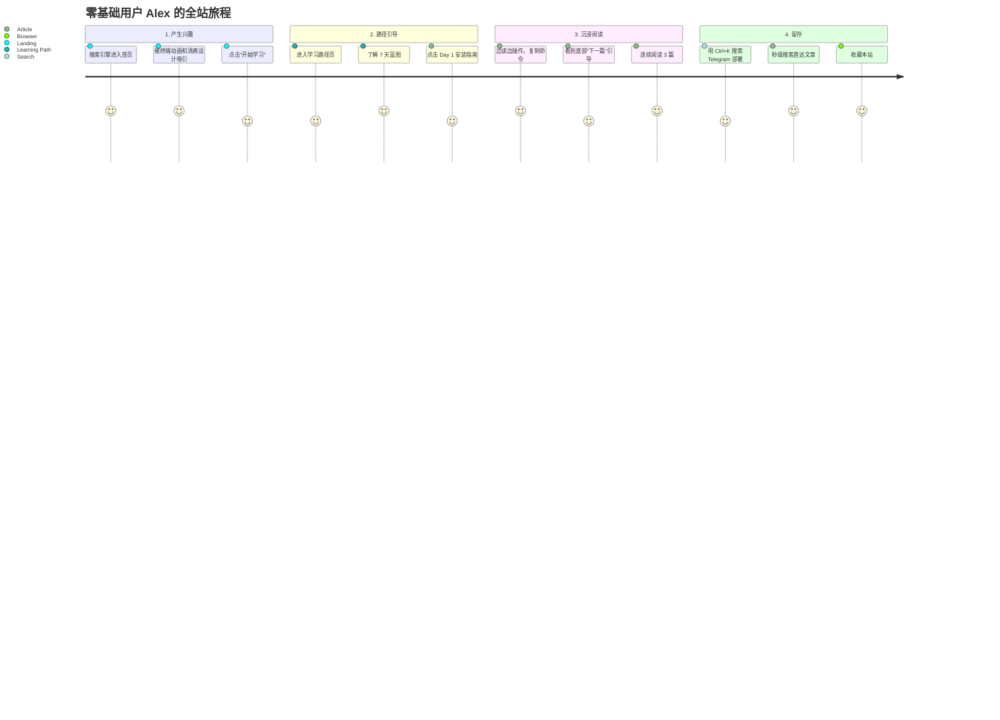

# UI/UX 设计规范 — hermesagent.sbs

> **确认方案：Option B — Warm Paper（护眼米光风）**
>
> 设计灵感：Notion、Medium、少数派等优质阅读社区
> 核心理念：温暖、护眼、有机质感，适合长时间技术阅读

---

## 1. 视觉识别系统 (Visual Identity)

### 1.1 色彩系统

```css
:root {
  /* ===== 背景层级 ===== */
  --bg-primary:     #fdfcf8;   /* 米白/象牙白 — 页面主背景 */
  --bg-secondary:   #f5f4ef;   /* 暖灰白 — 卡片/模块背景 */
  --bg-tertiary:    #ebece8;   /* 浅灰 — 悬浮态/输入框 */
  --bg-code:        #ffffff;   /* 纯白 — 代码块背景 */

  /* ===== 品牌色 — 深琥珀 ===== */
  --accent:         #d97706;   /* 深琥珀 — 按钮、高光 */
  --accent-hover:   #b45309;   /* 深化悬浮 */
  --accent-muted:   rgba(217, 119, 6, 0.1);  /* 淡底色 */
  --accent-glow:    rgba(217, 119, 6, 0.15); /* 光晕 */

  /* ===== 辅助色 ===== */
  --color-link:     #2563eb;   /* 链接蓝 */
  --color-link-hover: #1d4ed8;
  --color-success:  #059669;   /* 成功/入门 */
  --color-warning:  #d97706;   /* 警告/中级 */
  --color-error:    #dc2626;   /* 错误/高级 */
  --color-info:     #0284c7;   /* 信息提示 */

  /* ===== 文字层级 ===== */
  --text-primary:   #1f2937;   /* 深灰 — 标题 */
  --text-main:      #333333;   /* 正文主色 */
  --text-muted:     #737373;   /* 辅助/描述文字 */
  --text-light:     #a3a3a3;   /* 占位符/禁用态 */

  /* ===== 边框与分割 ===== */
  --border:         #e5e5e5;
  --border-hover:   #d4d4d4;
  --border-highlight: rgba(217, 119, 6, 0.4);
  --divider:        rgba(0, 0, 0, 0.06);

  /* ===== 难度标签 ===== */
  --badge-beginner:     #dcfce7;
  --badge-beginner-text:#166534;
  --badge-intermediate: #fef3c7;
  --badge-intermediate-text: #92400e;
  --badge-advanced:     #fecaca;
  --badge-advanced-text:#991b1b;

  /* ===== 间距系统 ===== */
  --space-xs:   4px;
  --space-sm:   8px;
  --space-md:   16px;
  --space-lg:   24px;
  --space-xl:   32px;
  --space-2xl:  48px;
  --space-3xl:  64px;
  --space-4xl:  96px;

  /* ===== 圆角 ===== */
  --radius-sm:   6px;
  --radius-md:   10px;
  --radius-lg:   16px;
  --radius-xl:   24px;
  --radius-full: 9999px;

  /* ===== 阴影（柔和风格） ===== */
  --shadow-sm:   0 1px 2px rgba(0, 0, 0, 0.04);
  --shadow-md:   0 4px 6px rgba(0, 0, 0, 0.06);
  --shadow-lg:   0 15px 30px rgba(0, 0, 0, 0.06);
  --shadow-card: 0 4px 6px rgba(0, 0, 0, 0.02);
  --shadow-card-hover: 0 15px 30px rgba(0, 0, 0, 0.06);

  /* ===== 过渡 ===== */
  --transition-fast:   150ms ease;
  --transition-normal: 250ms ease;
  --transition-slow:   400ms ease;

  /* ===== 最大宽度 ===== */
  --max-width-content: 1200px;
  --max-width-article: 780px;
  --max-width-wide:    1400px;
}
```

### 1.2 排版系统

```css
@import url('https://fonts.googleapis.com/css2?family=Inter:wght@400;500;600;700;800&family=JetBrains+Mono:wght@400;500&display=swap');

:root {
  --font-sans: 'Inter', -apple-system, BlinkMacSystemFont, 'Segoe UI', sans-serif;
  --font-mono: 'JetBrains Mono', 'Fira Code', 'Cascadia Code', monospace;

  /* 字体大小 */
  --text-xs:   0.75rem;    /* 12px */
  --text-sm:   0.875rem;   /* 14px */
  --text-base: 1rem;       /* 16px */
  --text-lg:   1.125rem;   /* 18px */
  --text-xl:   1.25rem;    /* 20px */
  --text-2xl:  1.5rem;     /* 24px */
  --text-3xl:  1.875rem;   /* 30px */
  --text-4xl:  2.25rem;    /* 36px */
  --text-5xl:  3rem;       /* 48px */
  --text-6xl:  3.75rem;    /* 60px — Hero 标题 */
}

/* 标题 */
h1 { font: 800 var(--text-5xl)/1.15 var(--font-sans); color: var(--text-primary); letter-spacing: -0.02em; }
h2 { font: 700 var(--text-4xl)/1.25 var(--font-sans); color: var(--text-primary); }
h3 { font: 600 var(--text-2xl)/1.35 var(--font-sans); color: var(--text-primary); }
h4 { font: 600 var(--text-xl)/1.4 var(--font-sans);   color: var(--text-primary); }

/* 正文 — 行高 1.75 是长文阅读的黄金比例 */
body { font: 400 var(--text-base)/1.75 var(--font-sans); color: var(--text-main); }

/* 代码 */
code { font: 400 var(--text-sm)/1.6 var(--font-mono); }
```

---

## 2. 页面线框图 (Wireframes)

### 2.1 首页 (Landing Page)

**设计思路：** 清爽温暖，首屏"WOW"，终端命令行动画吸引极客

```
┌────────────────────────────────────────────────────────────────────────┐
│ [Logo] HermesAgent             Tutorials  Guides  Blog  [ 🌎 ZH/EN ] │
│                                                  (吸顶,毛玻璃,米白底)   │
├────────────────────────────────────────────────────────────────────────┤
│                                                                        │
│                   (极淡琥珀色径向渐变光晕 radial-gradient)              │
│                                                                        │
│               Master Hermes Agent                                      │
│               从零基础到 AI 自动化专家                                 │
│                                                                        │
│            [ ⚡ 开始学习 (琥珀主色) ]   [ 📚 浏览教程 (描线按钮) ]       │
│                                                                        │
│            ┌──────────────────────────────────────────┐                │
│            │ $ hermes setup                           │                │
│            │ 正在初始化你的 AI 助手...                │ (打字机效果)    │
│            │ ██████████████████ 100%                 │                │
│            └──────────────────────────────────────────┘                │
│            (白底终端窗口, 柔和阴影, 圆角)                               │
│                                                                        │
├────────────────────────────────────────────────────────────────────────┤
│                    ⭐ 74.9k Github Stars (动态计数)                     │
├────────────────────────────────────────────────────────────────────────┤
│                                                                        │
│  🎯 Why Hermes Agent?                                [查看更多 →]      │
│  ┌─────────────────┐  ┌─────────────────┐  ┌─────────────────┐        │
│  │ 🧠               │  │ 🌐               │  │ 🔄               │        │
│  │ Self-Learning     │  │ Deploy Anywhere  │  │ Multi-Agent      │        │
│  │ Loop             │  │                  │  │ Orchestration    │        │
│  │                  │  │                  │  │                  │        │
│  │ 自动从经验中创建  │  │ Telegram/Discord │  │ 并行子Agent，    │        │
│  │ 技能并自我提升    │  │ /CLI 多端互通    │  │ Host统一调度     │        │
│  └─────────────────┘  └─────────────────┘  └─────────────────┘        │
│  (白底卡片, 1px 边框, 悬浮时顶部金色光束 + 上浮阴影)                    │
│                                                                        │
├────────────────────────────────────────────────────────────────────────┤
│  📚 系列教程推荐                                                       │
│  [ 卡片: 7天入门 ] [ 卡片: Telegram配置 ] [ 卡片: Skills指南 ]          │
├────────────────────────────────────────────────────────────────────────┤
│  ❓ FAQ (手风琴展开, 绿色左侧饰带)                                      │
├────────────────────────────────────────────────────────────────────────┤
│  Footer: 4列链接 | 社交图标 | 版权                                      │
└────────────────────────────────────────────────────────────────────────┘
```

### 2.2 教程文章页 (Tutorial Detail)

**设计思路：** 沉浸式阅读，核心宽度限制 780px，右侧粘性目录

```
┌────────────────────────────────────────────────────────────────────────┐
│ [Logo] HermesAgent             Tutorials  Guides  Blog  [ 🌎 ZH/EN ] │
├────────────────────────────────────────────────────────────────────────┤
│                                                                        │
│  首页 > 教程 > 🚀入门 > 安装指南                   (面包屑导航)        │
│                                                                        │
│  ┌────────────────────────────────────────────────┬─────────────────┐  │
│  │                                                │ ≡ 页面目录       │  │
│  │  # 如何在任何平台上安装 Hermes Agent           │   1. 环境要求    │  │
│  │                                                │   2. 极速安装    │  │
│  │  👨‍💻 Hermes Community  📅 2026-04-15           │   3. 常见报错    │  │
│  │                                                │   4. 下一步      │  │
│  │  [ 🟢 新手友好 ]  [ ⏱ 8分钟阅读 ]              │ (粘性定位,       │  │
│  │                                                │  滚动高亮跟踪)   │  │
│  │  ## 环境要求                                    │                 │  │
│  │  正文内容，行高1.75...                          │ ────────────────│  │
│  │                                                │ 📌 相关推荐      │  │
│  │  ┌─ 安装命令 ───────────────────[ 📋 复制 ]┐   │  - 第一次对话    │  │
│  │  │ curl -fsSL https://raw.../install.sh    │   │  - 选择AI模型    │  │
│  │  │         | bash                          │   │  - CLI基础       │  │
│  │  └────────────────────────────────────────┘   │                 │  │
│  │                                                │ ────────────────│  │
│  │  > [!TIP]                                      │ 📋 同系列文章    │  │
│  │  > 国内服务器请配置 HTTP 代理                   │  1. ✅ 安装指南   │  │
│  │                                                │  2. ⬜ 第一次对话 │  │
│  │  ## 极速安装                                    │  3. ⬜ 选择模型   │  │
│  │  正文内容...                                    │                 │  │
│  │                                                │                 │  │
│  │  ┌─ 下一步 ─────────────────────────────┐     │                 │  │
│  │  │  ← 上一篇    系列 1/6    下一篇 →    │     │                 │  │
│  │  └──────────────────────────────────────┘     │                 │  │
│  └────────────────────────────────────────────────┴─────────────────┘  │
│                                                                        │
│  ┌─ 分享 ──────────────────────────────────────────────────────────┐  │
│  │  🐦 Tweet · 📋 Copy Link · 💬 Discuss                          │  │
│  └─────────────────────────────────────────────────────────────────┘  │
│                                                                        │
│  ┌─ 推荐阅读 ─────────────────────────────────────────────────────┐  │
│  │  [卡片] [卡片] [卡片]                                           │  │
│  └─────────────────────────────────────────────────────────────────┘  │
└────────────────────────────────────────────────────────────────────────┘
```

### 2.3 教程列表页 (Tutorials Index)

```
┌────────────────────────────────────────────────────────────────────────┐
│  教程中心                                                              │
│  [ 全部 ] [ 入门 ] [ 消息平台 ] [ 技能 ] [ 自动化 ] [ 进阶 ]          │
│  [ 🟢 入门 ] [ 🟡 中级 ] [ 🔴 高级 ]          排序: 最新 ▾            │
│                                                                        │
│  ┌────────────┐  ┌────────────┐  ┌────────────┐                       │
│  │ 封面图      │  │ 封面图      │  │ 封面图      │                       │
│  │ 📗 入门     │  │ 📗 入门     │  │ 📘 消息     │                       │
│  │ 安装指南    │  │ 第一次对话  │  │ TG 配置     │                       │
│  │ 🟢 8min    │  │ 🟢 6min    │  │ 🟡 12min   │                       │
│  └────────────┘  └────────────┘  └────────────┘                       │
│                                                                        │
│  ┌────────────┐  ┌────────────┐  ┌────────────┐                       │
│  │ ...         │  │ ...         │  │ ...         │                       │
│  └────────────┘  └────────────┘  └────────────┘                       │
│                                                                        │
│  [ 加载更多 ]                                                          │
└────────────────────────────────────────────────────────────────────────┘
```

---

## 3. UX 用户流程 (User Flow)



---

## 4. 核心交互动效规范 (Micro-Interactions)

### 4.1 导航栏 (Navbar)
- 毛玻璃效果 `backdrop-filter: blur(12px)` + 半透明米白底
- 滚动超过 100px 时边框底线变深，增加视觉分离感
- 移动端：汉堡菜单，侧滑面板

### 4.2 卡片悬浮 (Card Hover)
- 整体上浮 `translateY(-5px)` + 阴影加深
- 顶部 3px 金色光束从左到右滑入 `translateX(-100%) → translateX(0)`
- 边框色切换为 `--border-highlight`
- 过渡时间 `300ms ease`

### 4.3 终端打字机 (Terminal Typewriter)
- CSS-only 动画，`steps(40)` 步进
- 光标闪烁 `0.75s step-end infinite`
- 命令敲完后，日志逐行 `fadeIn` 淡入（0.5s 延迟递增）
- 最后一行绿色高亮 "🚀 Hermes Agent is active and ready."

### 4.4 代码块"一键复制"
- 默认隐藏复制图标，Hover 代码块时淡入
- 点击后图标变 ✅，右上角出现绿色 Toast "Copied"
- 1.5s 后自动消失

### 4.5 文章目录 (TOC Sidebar)
- 粘性定位 `position: sticky; top: 80px`
- 当前章节对应的目录项左侧有 3px 琥珀色高亮条
- 滚动时高亮条平滑缓动过渡

### 4.6 页面切换
- 新页面内容 `opacity: 0 → 1` + `translateY(8px) → 0`
- 过渡 `300ms ease-out`

### 4.7 搜索弹窗 (Cmd/Ctrl+K)
- 背景模糊 + 半透明遮罩
- 搜索框居中弹出，带毛玻璃质感
- Pagefind 静态引擎驱动，输入即出结果，无网络延迟
- ESC 或点击遮罩关闭

### 4.8 Alert/Callout 提示块
- 左侧 4px 彩色饰带（TIP=绿, IMPORTANT=蓝, WARNING=黄, CAUTION=红）
- 极淡背景色块
- 圆角 `radius-md`

---

## 5. 响应式断点

| 断点 | 宽度 | 布局变化 |
|------|------|---------|
| Mobile | < 768px | 单列，隐藏 TOC sidebar，汉堡菜单，卡片全宽 |
| Tablet | 768-1024px | 双列卡片，TOC 折叠成悬浮按钮 |
| Desktop | > 1024px | 三列卡片，文章 65/35 分栏 + 粘性 TOC |

---

## 6. 核心组件清单

| 组件 | 交互 |
|------|------|
| `Navbar` | 毛玻璃, 滚动压缩, 移动端汉堡菜单 |
| `Footer` | 4列链接, Newsletter, 社交图标 |
| `HeroSection` | 终端打字动效, CTA 按钮, 渐变光晕 |
| `FeatureCard` | 悬浮光效 + 缩放 + 金色光束 |
| `TutorialCard` | 封面 + 标签 + 难度 + 阅读时间, 悬浮上移 |
| `CodeBlock` | 语法高亮 + 文件名标签 + 一键复制 |
| `TOCSidebar` | 粘性定位, 滚动高亮当前章节 |
| `SearchModal` | Cmd+K 全屏搜索, Pagefind 驱动 |
| `FAQAccordion` | 手风琴展开/收起, 平滑动画 |
| `Breadcrumb` | 面包屑导航 + Schema.org 标记 |
| `DifficultyBadge` | 🟢🟡🔴 难度标签 |
| `SeriesNavigation` | 上一篇/下一篇 + 系列进度列表 |
| `RelatedArticles` | 底部 3 张推荐卡片 |
| `ShareBar` | Twitter/LinkedIn + 复制链接 |
| `LanguageSwitcher` | EN/ZH 下拉切换 |
| `NewsletterForm` | 邮箱验证 + 订阅成功提示 |

---

## 7. 可视化参考

UI 高保真 HTML 原型（可直接浏览器打开）：

- **Option B 确认版**: `docs/mockup.html`（同步复制到项目中）
